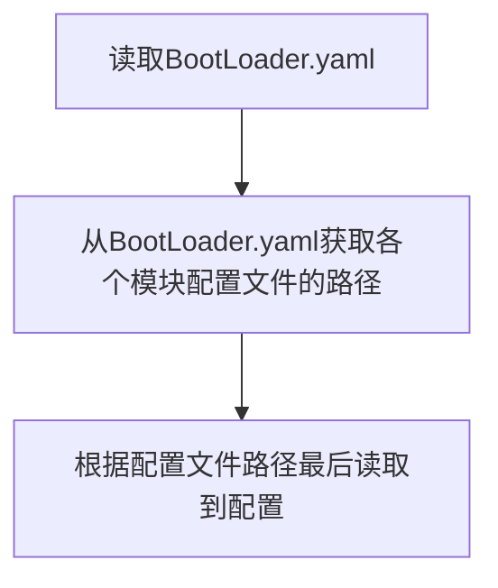

## 开发环境【Goland】

#### 第一步：安装依赖

1. 首先clone项目到本地，用 **goland** 打开，要安装一些依赖，耐心等待一会儿

> 依赖哪些大家可以看 go.mod 文件

<br>


-----

#### 第二步：寻找配置文件

2. 环境准备完毕之后，注意到有一个 `config` 文件夹，里面存放了配置相关的，`config/file.example` 存放了 **yaml** 配置文件，<font color=red>这个配置文件编译后是找不到的，所以需要自己在部署的环境上上传服务器，然后指定文件路径，当然在开发环境下就不用管那么多了</font>

<br>


----

#### 第三步：环境准备

3. 前提是你配置要正确，比如redis有没有装，地址有没有对，mysql数据库名字正不正确等），**注意，刚启动时数据库是没有建立的，需要手动建立数据库，建立一个 名字为 note 数据库   ，本项目的表是用gorm配置的，所以在第一次启动时，需要在  ** ```AppConfig.yaml``` 的 ```MakeMigration: true``` 设置为 **True** ，表示开始迁移表结构。

**Appconfig.yaml**

```yaml
PageSize: 13 #这一项先不用改变
MakeMigration: true #下次启动要设置为false了 如果你要修改表结构 则启动还要设置为true 详情请看gorm文档关于数据库迁移内容

QiniuAccessKey: xxxx #七牛oss相关配置
QiniuSecretKey: xxxx
LogFilePath: pkg/logging/log.log  #这一项删除也没事  就这样也没事 目前还用不到
```

<br>

> 具体环境如下：
>
> - 七牛oss空间【小流量免费】 如果不需要 直接在 main.go 注释掉 Qiniu.setup() 即可
> - mysql
> - redis
> - 域名

<br>

<br>


----

#### 第四步：运行main.go

4. 下面在 **main.go** 所在的目录下，也就是顶层目录下，运行如下命令（路径和文件都是可以自己修改的）

**BootLoader.yaml** 记录的是各个模块的配置文件路径（也可以都放在一个配置文件下，笔者觉得这样太混了，所以分开，用 BootLoader.yaml 读取各个配置文件）

```bash
go run main.go - c config/file.example/BootLoader.yaml #在win下的goland下跑的话就是这个路径 不用修改  看目录结构就看得出 这是相对路径 
```



<br>


<br>

<br>


---

#### 第五步：验证后端

根据配置的端口和主机，比如：

```http
localhost:9000/ping
```

如果返回 ```Pong``` 则表示成功！

<br>


----

#### 第六步：配置vue前端

前端的 ```vue.config.js``` 目录下配置了 node服务器相关的配置

```js
module.exports = {
    devServer: {
        port:9002, #表示前端启动的端口

        proxy: {
            '/api': {    // 转发路径
                target: 'http://localhost:9000',  // 后端地址
                ws: true, // 是否代理websockets
                changeOrigin: true ,  // 设置同源  默认false，是否需要改变原始主机头为目标URL,
                pathRewrite: {
                    '^/api': ''   // 把 '/api/user' 替换为 '/user'
                }
            }

        }


    }
};
```

```http
localhost:9002/api/user  --->  locahost:9000/user
```

这就是 **跨域配置**

运行命令，然后项目就会以 9002 端口 运行

```bash
npm run serve
```

<br>

<br>


----

#### 第七步：测试前端

> 注意，要前后端同时开启

```http
locahost:9002/
```

然后就会看到界面了。


----

linux生产环境 编译后

```bash
[root@blog www.binnb.top]# ls
main note-gin-cfg
[root@blog www.binnb.top]# ls note-gin-cfg
AppConfig.yaml   MySqlConfig.yaml  ServerConfig.yaml
BootLoader.yaml  RedisConfig.yaml
[root@blog www.binnb.top]# ./main -c note-gin-cfg/BootLoader.yaml
```

**后面的path是在Linux下配置文件的路径 配置文件需要单独上传**

下面是```BootLoader.yaml``` 文件的内容，这个内容根据大家配置文件的目录不同可以**自由修改**，只要main能找的到就行

```yaml
AppPath: note-gin-cfg/AppConfig.yaml
ServerPath: note-gin-cfg/ServerConfig.yaml
MySqlPath: note-gin-cfg/MySqlConfig.yaml
RedisPath: note-gin-cfg/RedisConfig.yaml
```


下面是我的配置文件，供大家参考，可以自己修改

pass


编译后的**main**文件在linux下一定要给予执行权限

```bash
chmod 777 main
```


## 为什么要这样配置

1. 部署方便（这也是golang的优势之一，也是我喜欢go的原因之一，毕竟被环境坑过...）,如果你换服务器了，只需要带走 main、配置文件这两样东西即可
2. 升级方便，如数据库升级....
3. 移动环境方便
4. 可以配置多套环境，如开发环境、测试环境、生产环境...
5. 总之.....没有总之了....


## 如何算部署成功

浏览器输入（网址，你自己配置的）：

```http
http://localhost:9000/ping
返回
Pong
```

就算成功了


## 开发环境的跨域问题

vue-config.js文件

```javascript
module.exports = {
    devServer: {
        port:9002,//npm run serve  启动前端 端口为9002  访问也是这个地址

        //下面是代理转发 axios会用 9002/api/url  这种方式来请求数据 这里将转化为 /9000/url
        proxy: {
            '/api': {    // search为转发路径
                target: 'http://localhost:9000',  // 后端地址
                ws: true, // 是否代理websockets
                changeOrigin: true ,  // 设置同源  默认false，是否需要改变原始主机头为目标URL,
                pathRewrite: {
                    '^/api': ''   // 把 '/api/user' 替换为 '/user'
                }
            }

        }


    }
};
```
